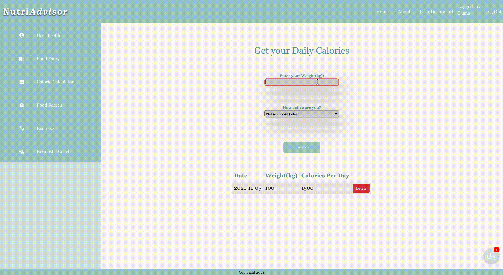

# NutriAdvisor - Web App

## The Team

- **[Sonam Malhotra](https://github.com/Smalhotra1996)**
- **[Yi Rong Qin](https://github.com/yq4103)**
- **[Yvette Lim](https://github.com/magotts)**

## Description 
A versatile app for people who wants to achieve goals such as lose/maintain/gain weight and healthy lifestyle with the help of coaches (optional). The user also has the ability to search for exercise and know how much calories were burned and search for food and know the values of each nutrients.

## Features:
- Request a Coach - if you want to be guided by one.

- Counting Daily Calories

- Logging Food Diary

- Search exercise and know how much calories were burned.

- Food Search - check the food's nutrients and its value per serving.

- Chat with your Coach

## Tech Stack
- Front-end: React
- Back-end: NodeJS, Express
- Database: PostgreSQL

## Dependencies
    "@emotion/react": "^11.5.0",
    "@emotion/styled": "^11.3.0",
    "@mui/icons-material": "^5.0.5",
    "@mui/material": "^5.0.6",
    "@testing-library/jest-dom": "^5.14.1",
    "@testing-library/react": "^11.2.7",
    "@testing-library/user-event": "^12.8.3",
    "axios": "^0.23.0",
    "bootstrap": "^5.1.3",
    "dotenv": "^8.2.0",
    "react": "^17.0.2",
    "react-bootstrap": "^2.0.0",
    "react-chat-widget": "^3.0.5",
    "react-dom": "^17.0.2",
    "react-router-dom": "^5.3.0",
    "react-scripts": "4.0.3",
    "socket.io-client": "^4.3.2",
    "styled-components": "^5.3.3",

In the project directory, you can run:

### `npm start`

for client(localhost:3000) and backend(localhost:5000) server. 

### `npm run db:reset`

to have a clean database.

## Enjoy and thank you!